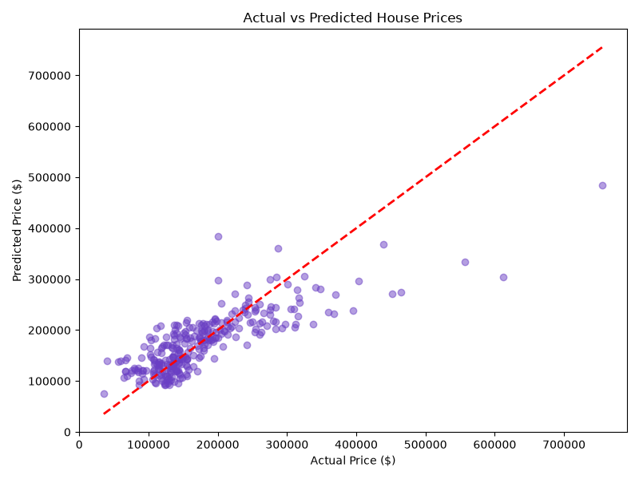

# PRODIGY_ML_01 - House Price Prediction using Linear Regression

## Task
Implement a linear regression model to predict house prices based on 
square footage (living area), number of bedrooms, and number of bathrooms.

## Dataset
[Kaggle - House Prices: Advanced Regression Techniques](https://www.kaggle.com/c/house-prices-advanced-regression-techniques/data)

## Approach
1. Loaded and explored the dataset (1,460 houses, 81 features)
2. Selected relevant features: `GrLivArea`, `BedroomAbvGr`, `FullBath`
3. Checked for missing values (none found)
4. Split data into 80% training / 20% testing sets
5. Trained a Linear Regression model using scikit-learn
6. Evaluated performance using RMSE and R² score
7. Visualized predicted vs actual prices

## Results
- **RMSE**: ~$52,976
- **R² Score**: 0.634 (model explains ~63% of price variation)

## Visualization

## Tech Stack
Python, pandas, numpy, scikit-learn, matplotlib, Jupyter Notebook

## How to Run
1. Clone this repo
2. Install dependencies: `pip install pandas numpy scikit-learn matplotlib jupyter`
3. Open `task01.ipynb` in Jupyter/VS Code and run all cells
